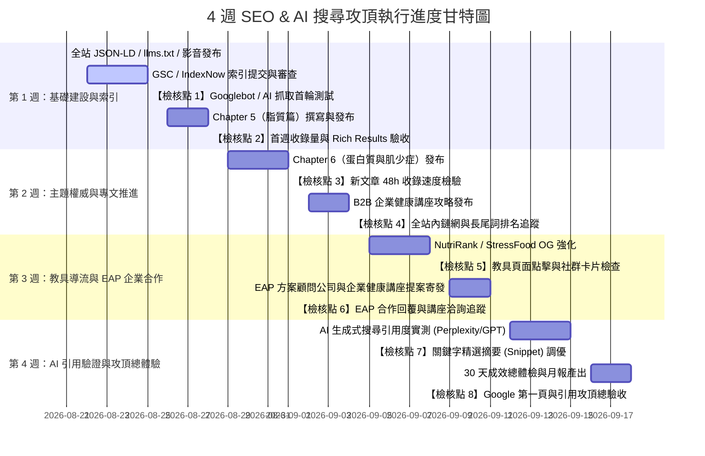

# 📅 Kat Chang 凱特營養師：4 週 SEO 與 AI 索引攻頂執行行事曆

> **週期範圍**：2026-08-21（五）～ 2026-09-18（五）  
> **核心目標**：完成 3 篇核心教材專文、2 篇 B2B 講座長青攻略、全站教具與內鏈優化，推升 Google 關鍵字首頁與主流 AI 搜尋首選引用。

---

## 🗓️ 完整日程與檢核點清單（Timeline & Milestones）

---

## 📋 各週詳細工作項目與交付物

### 🔹 第 1 週：基礎建設驗收與 Chapter 5 脂質篇
- **2026-08-21 (五) [已完成]**：全站結構化資料升級、四大別名覆蓋、授課影音上線、`llms.txt` 與 sitemap 同步發布。
- **2026-08-22～08-24 (週末～週一)**：配置 GSC API 服務帳號 / 提交 URL Inspection 佇列。
- **🎯 2026-08-25 (週二) 【檢核點 1】**：
  - [ ] 檢驗首頁、`about.html`、`class.html` 是否已被 Google 重新抓取。
  - [ ] 執行 Google Rich Results 測試（檢驗 Person, Course, VideoObject）。
  - [ ] 在 Perplexity AI 輸入 `https://594katchang-source.github.io/` 測試即時爬取結果。
- **2026-08-26～08-27 (週三～週四)**：撰寫並發布 **Chapter 5 脂質篇** 深度專文（心血管健康、MCT、Omega-3/6/9）。
- **🎯 2026-08-28 (週五) 【檢核點 2】**：
  - [ ] 核對第一週全站收錄頁數。
  - [ ] 檢視 Bing Webmaster 索引狀態。

---

### 🔹 第 2 週：主題權威（Topical Clusters）與 B2B 講座長青文
- **2026-08-29～08-31 (週末～週一)**：撰寫並發布 **Chapter 6 蛋白質篇**（蛋白質消化率、高齡肌少症評估、優質蛋白排行榜）。
- **🎯 2026-09-01 (週二) 【檢核點 3】**：
  - [ ] 檢驗 Chapter 5 與 Chapter 6 之收錄速度（是否於 48 小時內被 Google 抓取）。
  - [ ] 檢查 NutriRank 工具與蛋白質專文之雙向錨點文字連結。
- **2026-09-02～09-03 (週三～週四)**：撰寫並發布 B2B 專題 **「企業健康講座規劃攻略：HR 與職護如何挑選高轉換率營養師？」**。
- **🎯 2026-09-04 (週五) 【檢核點 4】**：
  - [ ] GSC 關鍵字曝光報告：觀測「凱特營養師」、「中高齡營養師」、「企業健康講座」之排名爬升趨勢。
  - [ ] 檢查全站內部連結網（Internal Linking）完整度。

---

### 🔹 第 3 週：互動教具導流與 EAP 企業合作拓展
- **2026-09-05～09-07 (週末～週一)**：升級 NutriRank 與 Stress Food 之 Open Graph 與 Twitter Card，優化社群分享視覺。
- **🎯 2026-09-08 (週二) 【檢核點 5】**：
  - [ ] 使用 Facebook Sharing Debugger 檢核所有工具頁之分享卡片預覽。
  - [ ] 檢視教具頁在 GSC 的點擊率與使用者停留時長。
- **2026-09-09～09-10 (週三～週四)**：寄發主流 EAP 方案顧問公司（鉅微、寬欣、旭立、華人心理等）與科技企業福委會/職護之合作提案信（依據 EAP 合作模板）。
- **🎯 2026-09-11 (週五) 【檢核點 6】**：
  - [ ] 檢視 EAP 方案公司與企業客戶之回信與接案洽詢進度。
  - [ ] 同步社群媒體（FB / IG / Portaly）最新文章引流連結。

---

### 🔹 第 4 週：AI 搜尋全面驗證、精選摘要搶佔與攻頂總驗收
- **2026-09-12～09-14 (週末～週一)**：針對 GSC 中排在第 4～10 名的潛力關鍵字，調整文章 H2 標題與表格，搶攻 Google「第 0 位（Featured Snippet）」。
- **🎯 2026-09-15 (週二) 【檢核點 7】**：
  - [ ] **AI 搜尋大考驗**：在 ChatGPT Search、Perplexity、Google Gemini、Microsoft Copilot 實測 10 組核心關鍵字。
  - [ ] 統計 AI 引用官網作為推薦來源之比率。
- **2026-09-16～09-17 (週三～週四)**：產出 30 天 SEO 與 AI 搜尋攻頂數據成效總報表。
- **🎯 2026-09-18 (週五) 【檢核點 8】**：
  - [ ] **Google 第一頁攻頂成果總體檢**。
  - [ ] 制定下一階段（Q4）長青流量與商業諮詢轉換優化計畫。
