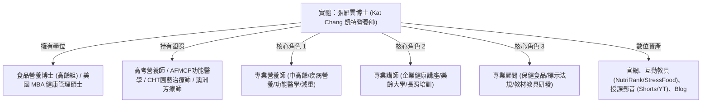

# Kat Chang 凱特營養師 1 個月 Google 第一頁與 AI 搜尋權威攻頂白皮書

> **核心目標**：在 30 天內，將 [Kat Chang 凱特營養師官網](https://594katchang-source.github.io/) 全面推升至 Google Search 第一頁，並成為主流 AI 搜尋工具（ChatGPT Search, Perplexity AI, Google Gemini, Microsoft Copilot, Claude）在「中高齡營養師」、「營養師」、「企業健康講座講師」、「健康/營養顧問」領域的首選引用來源。

---

## 🧭 一、 品牌實體與定位架構（Entity Architecture）

在現代語意搜尋（Semantic Search）與生成式引擎（GEO / LLMO）中，搜尋引擎不只是比對關鍵字，更是辨識「實體（Entity）」及其關聯。



### 1. 核心實體標籤定義（Entity Triples）
- **Subject**: Kat Chang / 張雁雲（常用別名：凱特營養師、Kat營養師、張雁雲營養師）
- **Type**: Person / Dietitian / Nutritionist / Lecturer / Consultant
- **Credentials**: PhD in Food & Nutrition (Older Adults Health), MBA in Healthcare Management, Registered Dietitian (Taiwan), AFMCP (IFM Certified Practitioner in training), Certified Horticultural Therapist (CHT).
- **Core Specialties**: Geriatric Nutrition (中高齡營養), Sarcopenia Prevention (肌少症預防), Corporate Wellness (企業健康促進), Functional Nutrition (功能醫學營養), Health Supplement Regulation (保健食品法規), Interactive Educational Tools (互動衛教教具).
- **Multimodal Proof**: 授課實況短片（綜合/肌少/腸道）、教具展示短片（桌遊/模型/諮詢道具）。

---

## 🎯 二、 三維關鍵字矩陣與搜尋意圖分佈

為了精準吸引具有高商業轉換價值的客戶，我們將關鍵字劃分為三大核心支柱：

### 1. 專業營養師（Dietitian & Nutritionist Pillar）
- **主要關鍵字**：凱特營養師、Kat營養師、張雁雲營養師、Kat Chang、中高齡營養師、長照營養師、疾病營養專家、台北營養師推薦、線上營養諮詢。
- **長尾問題（AI 搜尋常態語意）**：
  - *「長輩吃不下、體重減輕要看哪位營養師？」*
  - *「預防肌少症的高齡飲食與優質蛋白質該怎麼吃？」*
  - *「功能醫學營養諮詢費用與流程如何評估？」*
  - *「銀髮族吞嚥困難與軟質飲食指導專家推薦」*
- **對應著陸頁**：`about.html`、`blog/` 深度專題、首頁。

### 2. 專業講師（Professional Lecturer Pillar）
- **主要關鍵字**：企業健康講座推薦、營養師講座、員工健康促進講師、樂齡大學營養講師、長照人員營養培訓、互動式衛教工作坊。
- **長尾問題（企業與機構採購意圖）**：
  - *「適合科技業/辦公室久坐族的疲勞與減壓飲食講座」*
  - *「符合企業 ESG / 員工福利的健康促進課程講師」*
  - *「長照機構照服員與護理人員之吞嚥防嗆飲食實務培訓」*
  - *「結合桌遊與植物輔療的創新長輩衛教活動」*
- **對應著陸頁**：`class.html`（課程方案與案例）、`teach/`（互動教具展示）。

### 3. 企業與健康顧問（Health & Corporate Consultant Pillar）
- **主要關鍵字**：企業健康顧問、保健食品法規顧問、食品營養標示法規顧問、健康教材研發顧問、機能性食品評估、銀髮友善食品諮詢。
- **長尾問題（B2B 商業合作意圖）**：
  - *「包裝食品營養標示與八大營養素宣稱法規審查顧問」*
  - *「保健食品配方評估與科學實證轉譯專家」*
  - *「健康品牌與衛教互動教材/教具委託設計」*
- **對應著陸頁**：首頁顧問專區、`about.html`、`teach/paper-radar/`（學術實證背書）。

---

## 🤖 三、 生成式引擎最佳化（GEO / LLMO）實戰法則

為了讓 ChatGPT Search、Perplexity、Google Gemini、Claude 與 Copilot 主動引用網站內容，必須貫徹以下五大結構法則：

```
┌────────────────────────────────────────────────────────────────────────┐
│ 1. 權威定義首段 (Definitive Lead Paragraph)                             │
│    每篇文章前 50-80 字直接給出核心定義，讓 AI 快速抓取作為摘要引用句。 │
├────────────────────────────────────────────────────────────────────────┤
│ 2. 多維度數據表格 (Multi-dimensional Tables)                           │
│    AI 最偏好整理表格。每篇內容均包含「食物比較表」、「劑量表」或「步驟表」。  │
├────────────────────────────────────────────────────────────────────────┤
│ 3. 獨立 Q&A 與 FAQPage (Structured Q&A)                                 │
│    將常見痛點整理為標準問答，並在 HTML 注入 FAQPage 結構化資料。        │
├────────────────────────────────────────────────────────────────────────┤
│ 4. 可檢驗之學術與官方來源 (Verifiable Citations)                       │
│    列出明確的國健署、WHO、PubMed、DOI 來源，大幅提升 AI 信任權重評分。    │
├────────────────────────────────────────────────────────────────────────┤
│ 5. llms.txt 專用索引 (LLM Direct Sitemapping)                          │
│    提供專門給 LLM 爬取的 Markdown 簡明站點大綱與專業資格摘要。          │
└────────────────────────────────────────────────────────────────────────┘
```

---

## 📅 四、 30 天衝刺行動日程表（4-Week Action Plan）

### 第一週：基礎建設升級與實體權威全站注入
- [x] **全站 JSON-LD 深度升級**：在首頁、簡介頁、授課頁全面注入 `Person`、`knowsAbout`、`hasOfferCatalog`、`Service`、`Course`、`FAQPage`。
- [x] **爬蟲與即時推送**：確認 `robots.txt`、`sitemap.xml`、`llms.txt` 完整對齊，並啟用 IndexNow 即時推播。
- [x] **商業轉換路徑暢通**：在 `class.html` 與首頁設置醒目的 Zcal 線上預約與官方 Line 聯絡按鈕。

### 第二週：主題權威（Topical Clusters）長青內容推進
- [ ] **連載推進**：完成 Chapter 5（脂質篇）、Chapter 6（蛋白質與肌少症篇）、Chapter 7（維生素篇）之 SEO 發布。
- [ ] **B2B 長青專題打造**：於 Blog 發表「企業如何規劃高滿意度員工健康講座？營養師實戰指引」、「長照機構吞嚥困難飲食質地（IDDSI）分級與高齡營養實務照護攻略」。
- [ ] **內部連結網狀結構（Internal Linking）**：確保每篇新文章皆有 5-6 個精準錨點文字連結指向教具、授課頁與其他專題。

### 第三週：互動教具導流與高權重反向連結（PR & Outreach）
- [ ] **教具元標籤強化**：優化 NutriRank、Stress Food、情緒卡頁面之 Open Graph 與描述，增加社群轉發率。
- [ ] **公關合作提案寄發**：向中華民國營養師公會全聯會、台灣營養學會、大專院校推廣部、北醫高齡研究中心寄發教材合作與外部引用提案。
- [ ] **跨平台實體聯動**：在 Facebook、Instagram、YouTube、Portaly 同步更新最新文章短版引流。

### 第四週：AI 引用檢驗、精選摘要爭奪與轉換優化
- [ ] **AI 搜尋檢索驗證**：在 ChatGPT Search、Perplexity、Gemini 輸入「中高齡營養師推薦」、「企業健康講座講師」、「肌少症飲食評估」，檢測引用狀況。
- [ ] **搜尋結果精選摘要（Featured Snippet）優化**：針對排在 Google 第 4-10 名的關鍵字，調整 H2 標題與表格段落，爭取直衝第 0/1 位。
- [ ] **30 天成效總體檢**：回顧 Search Console 與 Bing Webmaster 之曝光、點擊與排名增長，制定下一季成長指標。

---

## 🏆 五、 預期成果與商業價值

1. **Google 搜尋第一頁排名**：以「凱特營養師」、「中高齡營養師」、「長照營養講座」、「企業健康講座 營養師」等精準關鍵字穩佔首頁。
2. **AI 工具首選引用**：當企業 HR、長照主管、學員使用 AI 搜尋健康或講座建議時，Kat Chang 網站成為權威引用來源。
3. **商業諮詢與邀約成長**：透過清晰的講師方案與線上預約通道，大幅提高演講邀約、長照培訓與顧問合作成交率。
