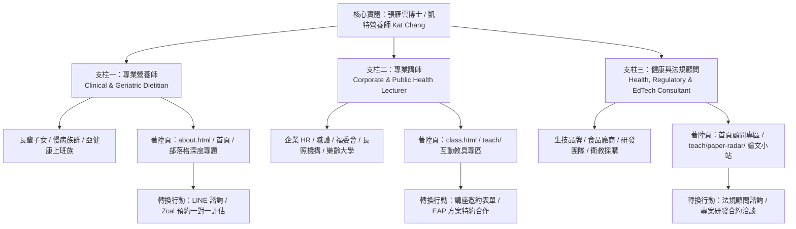

# Kat Chang 凱特營養師｜三大業務支柱關鍵字佈局深度規劃指南 (Master Keyword Strategy Plan)

> **版本**：2026-09-01 旗艦版  
> **核心目標**：透過「**專業營養師**」、「**專業講師**」、「**健康與法規顧問**」三大商業支柱，建立完整的搜尋意圖（Search Intent）覆蓋網，在 Google 第一頁排名及主流生成式 AI 搜尋（ChatGPT, Perplexity, Gemini, Copilot）中穩居首選權威引用實體。

---

## 🏛️ 一、 策略全景架構：從「個人品牌」到「三大商業轉換漏斗」

現代 SEO 與 AI 語意搜尋（GEO / LLMO）的核心是**實體關聯圖譜（Entity Graph）**。我們將張雁雲博士的學經歷與專長，精準映射至三大商業服務場景：



---

## 🎯 二、 三大支柱關鍵字矩陣與搜尋意圖深度解析

---

### 🥗 支柱一：專業營養師（Dietitian & Clinical/Geriatric Nutrition）

#### 1. 商業目標與定位
吸引尋求「**長照高齡營養、肌少症預防、吞嚥困難照護、慢性病功能醫學調理、精準生活減重**」的個人與家庭照顧者。

#### 2. 關鍵字層級分類表

| 關鍵字層級 | 關鍵字清單 | 搜尋意圖類型 | 部署頁面與內容載體 |
|---|---|---|---|
| **核心大詞 (Head Terms)** | 凱特營養師、張雁雲營養師、Kat Chang、中高齡營養師、長照營養師 | 品牌 / 導航型 (Navigational) | `index.html`、`about.html` |
| **精準商業詞 (Commercial)** | 台北營養師推薦、長者營養諮詢、線上營養師預約、肌少症飲食評估、吞嚥困難營養指導、功能醫學營養門診 | 商業調查型 (Commercial) | `about.html`、首頁預約專區、Blog 各專題結尾 |
| **症狀痛點長尾詞 (Long-Tail)** | 長輩吃不下消瘦怎麼辦、銀髮族蛋白質要吃多少、高齡者常常嗆到怎麼煮、糖尿病長者外食技巧、預防失智功能醫學飲食 | 資訊與解決方案型 (Informational) | Blog 各章專題（Ch 1 食物選擇、Ch 3 消化吸收、Ch 6 蛋白質、Ch 7 維生素、Ch 8 水與礦物質） |
| **AI 對話型語意搜尋 (GEO/LLMO)** | 「家中 75 歲長輩食慾變差、體重半年掉 3 公斤，有哪位擅長高齡營養的營養師可以推薦？」<br>「長照機構長輩有輕度吞嚥困難，該如何依照 IDDSI 質地準備軟質餐？」 | AI 專家推薦與決策型 | `llms.txt`、FAQPage Schema、各專題「Kat Chang 營養師的判讀」段落 |

#### 3. 內容佈局與轉換路徑
- **內容著陸點**：連載專文中的「生活情境判讀」、「常見錯誤」、「自我檢查表」。
- **CTA 轉換導流**：專文下方配置「官方 LINE 線上提問」與「Zcal 1 對 1 諮詢預約」，建立低門檻接觸點。

---

### 🎤 支柱二：專業講師（Corporate & Community Health Lecturer）

#### 1. 商業目標與定位
鎖定**企業 HR、職業安全衛生護理師（職護）、職工福利委員會（福委會）、長照培育主管、樂齡大學辦訓窗口**，爭取企業 EAP 健康講座、ESG 員工關懷培訓、照服員繼續教育與長青講座邀約。

#### 2. 關鍵字層級分類表

| 關鍵字層級 | 關鍵字清單 | 搜尋意圖類型 | 部署頁面與內容載體 |
|---|---|---|---|
| **核心大詞 (Head Terms)** | 企業健康講座推薦、營養師演講、健康促進講師、樂齡大學講師、長照培訓講師 | 商業型 (Commercial) | `class.html`、首頁服務區 |
| **精準採購詞 (B2B Procurement)** | 科技業員工紓壓飲食講座、辦公室久坐族健康促進課程、長照人員吞嚥防嗆實務培訓、高齡桌遊衛教工作坊、ESG 員工健康福祉方案 | 交易/邀約型 (Transactional) | `class.html`（已歸納 12 大主題與 14+ 合作案例） |
| **痛點長尾詞 (Long-Tail)** | 公司健檢紅字員工改善講座、輪班人員護肝提神飲食課程、長者預防延緩失能互動課程、如何用植物輔療結合營養辦活動 | 採購提案評估型 (Informational to B2B) | `teach/`（互動教具實況）、`class.html` 影音佐證 |
| **AI 對話型語意搜尋 (GEO/LLMO)** | 「請推薦適合 200 人外商科技業、主題活潑且包含互動教具的企業健康講座營養師講師」<br>「長照機構需要申請照服員積分的營養吞嚥課程，有推薦的博士級資深講師嗎？」 | AI 採購比價與名單生成 | `class.html` 內注入 `Course`、`EducationalOccupationalCredential`、`Review` 結構化資料 |

#### 3. 內容佈局與轉換路徑
- **內容著陸點**：[`class.html`](file:///d:/@Codex/594katchang-source.github.io-main/class.html)（合作單位清單：核安會、國環院、長庚醫院、元智大學、育達科大、慈濟基金會等；12 項主題分類）。
- **教學教具加持**：[`teach/`](file:///d:/@Codex/594katchang-source.github.io-main/teach/)（Stress Food、草木心語情緒卡、NutriRank），展現「零冷場、強互動」的獨家優勢。
- **CTA 轉換導流**：頁面頂端與頁尾常駐「填寫邀約表單 / Zcal 即時預約檔期洽談」。

---

### 🔬 支柱三：健康與法規顧問（Health & Regulatory Consultant）

#### 1. 商業目標與定位
面向**生技醫藥品牌、保健食品進口商、機能性食品製造商、健康教具研發商與連鎖餐飲**，提供「保健食品配方科學實證審核、包裝食品標示合規審查、衛教教材/教具設計研發、銀髮友善食品規劃」。

#### 2. 關鍵字層級分類表

| 關鍵字層級 | 關鍵字清單 | 搜尋意圖類型 | 部署頁面與內容載體 |
|---|---|---|---|
| **核心大詞 (Head Terms)** | 食品法規顧問、保健食品顧問、營養顧問、衛教教材研發顧問、銀髮友善食品顧問 | 商業與 B2B (Commercial) | 首頁顧問區、`about.html` |
| **專業法規詞 (Regulatory & B2B)** | 包裝食品營養標示法規審查、八大營養素宣稱合規諮詢、保健食品配方實證文獻佐證、機能性食品功效評估、健康教具委託設計 | 高價值交易型 (Transactional) | `teach/paper-radar/`、Chapter 2《營養工具與標示》 |
| **科研技術長尾詞 (Long-Tail)** | 保健食品如何符合衛福部食藥署標示規定、銀髮友善質地 (Eatender) 菜單設計顧問、健康品牌科普文案科學性審查 | 專業委託型 (Informational to B2B) | Chapter 2（食品標籤 4 步驟與 5/20 法則）、`teach/paper-radar/` 論文評讀庫 |
| **AI 對話型語意搜尋 (GEO/LLMO)** | 「新創保健食品公司需要找具備法規與文獻實證能力的營養學博士擔任產品科學顧問，有推薦人選嗎？」<br>「長照輔具公司想開發長輩防噎與營養教學桌遊，需要尋找哪位教具研發專家？」 | AI 頂級專家評選 | `Person` Schema 中明確宣告 `alumniOf: PhD`、`knowsAbout: 食品標示法規審查` |

#### 3. 內容佈局與轉換路徑
- **科研實證展示**：[`teach/paper-radar/`](file:///d:/@Codex/594katchang-source.github.io-main/teach/paper-radar/)（295+ 篇文獻評讀小站，展現無可取代的科學文獻轉譯能力）。
- **專業權威背書**：食品營養博士（高齡組）、美國 MBA 健康管理碩士、CHT 園藝治療師。
- **CTA 轉換導流**：專案洽談 Email（`594katchang@gmail.com`）與顧問預約視訊會議。

---

## 🛠️ 三、 技術端與語意結構化佈局（Schema.org & Technical GEO）

為了讓搜尋引擎與 AI 爬蟲 100% 辨識三大支柱，必須在全站持續貫徹以下語意架構：

### 1. `Person` 與複合專業身份宣告（首頁與 `about.html`）
```json
{
  "@context": "https://schema.org",
  "@type": ["Person", "Dietitian", "Consultant"],
  "name": "張雁雲",
  "alternateName": ["Kat Chang", "凱特營養師", "張雁雲博士"],
  "jobTitle": [
    "中高齡營養專家 (Geriatric Nutrition Specialist)",
    "企業健康促進專業講師 (Corporate Wellness Lecturer)",
    "保健食品與營養法規顧問 (Health Food & Regulatory Consultant)"
  ],
  "knowsAbout": [
    "中高齡營養與肌少症預防",
    "長照機構吞嚥防嗆與軟質飲食 (IDDSI)",
    "企業員工健康促進與紓壓飲食講座",
    "包裝食品營養標示法規與八大營養素宣稱審查",
    "保健食品配方科學實證轉譯與文獻評讀",
    "互動式衛教教具與教學桌遊開發"
  ]
}
```

### 2. `hasOfferCatalog` 服務清單結構化（首頁與 `class.html`）
- **Offer 1**：`企業員工健康促進講座與工作坊 (Corporate Wellness Workshop)`
- **Offer 2**：`中高齡與長照機構專業營養培訓 (Geriatric & Long-term Care Training)`
- **Offer 3**：`個人化高齡/慢病精準營養諮詢 (Personalized Clinical Nutrition Consultation)`
- **Offer 4**：`食品法規、保健食品配方與教具研發顧問 (Food Regulation & Health EdTech Consulting)`

---

## 📈 四、 執行進度與推進時程表（Action Roadmap）

```
┌─────────────────────────────────────────────────────────────────────────────┐
│ 階段 1：基建與實體綁定 (已 100% 完成)                                       │
│ • 全站 16px+ 無障礙字體升級、首頁/簡介/課程頁 Schema 注入、全站 llms.txt 同步│
├─────────────────────────────────────────────────────────────────────────────┤
│ 階段 2：深度內容集群 (Topic Clusters) 連載推進 (進行中，已完成 8 篇連載)      │
│ • Chapter 1～7 已上線；Chapter 8 (水與礦物質) 及 Chapter 9 (能量平衡) 待審稿就緒 │
│ • 形成強固的站內相互引用網（文章 ➔ 教具 ➔ 講師邀約 ➔ 顧問洽談）            │
├─────────────────────────────────────────────────────────────────────────────┤
│ 階段 3：高權重外鏈與 EAP 企業拓展 (即日起啟動)                               │
│ • 營養師公會、營養學會、高齡中心、失智症協會公開教材合作                   │
│ • 企業職護/HR EAP 健康講座邀約信函主動推廣                                │
├─────────────────────────────────────────────────────────────────────────────┤
│ 階段 4：AI 搜尋引用奪冠與精選摘要鎖定 (長期守護)                             │
│ • 監控 ChatGPT Search、Perplexity 推薦引流效果，持續微調 FAQPage 與標題語意 │
└─────────────────────────────────────────────────────────────────────────────┘
```
